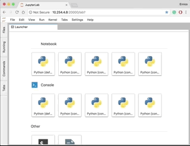

Title: JupyterCon 2018
Date: 2018-08-31 18:25
Category: Generic

 
# JupyterCon 2018: Open Source, Collaboration & More

JupyterCon is a yearly conference held in New York City that promotes the Jupyter project, its values and a the notable projects built on top of it.
It's organized by NumFOCUS and O'Reilly Media with the support of several commercial sponsors.
You can check out the schedule [here](https://conferences.oreilly.com/jupyter/jup-ny/schedule/2018-08-21) and hopefully save the date for 2019!

Thanks to my company [@Hal24k](https://twitter.com/Hal24k) I attended the 2018 edition for the entire 4 days.
It's been a great experience with lots of inspiring talks and insightful tutorials.
Make sure to check out the [related events](https://conferences.oreilly.com/jupyter/jup-ny/public/schedule/stype/1268): poster session & drinks took place before or after the conference hours; note there were additional events arranged by main sponsors (like Netflix) held in external venues, but these are not listed on the conference webpage.

## Highlights

You can check the keynotes linked in [O'Reilly page](https://www.oreilly.com/ideas/highlights-from-jupytercon-ny-2018).
My favorites are:

- Paco Nathan's "Jupyter trends in 2018"
- Carol Willing's "Sustaining wonder: Jupyter and the knowledge commons"
- Tracy Teal's "Democratizing data"
- Julia Meinwald's "Why contribute to open source?"
- Fernando Perez's "Sea change: What happens when Jupyter becomes pervasive at a university?"

Since Paco's keynote is the best in my opinion, here's the video.
This one, in particular, gives you an overview of the scale of Jupyter project, and it's just terrific to see so much potential.

    <iframe width="560" height="315" src="https://www.youtube.com/embed/t0MNlJV7_gM" frameborder="0" allow="autoplay; encrypted-media" allowfullscreen></iframe>

## Lesson learned

Foremost take home is a deeper understanding of what Jupyter actually is.
As many data scientist, I've been using Jupyter Notebook and JupterLab in my daily work.
I thought it was a revolutionary tool that brought IPython interactivity to the next level.
I was wrong.
The first mistake was confusing Jupyter with Notebook or Lab as part of the unique blob.
If you think about that's quite common.
Most users start with these tools by working on a scientific assignment and all they care is getting to the results.
You don't ask yourself much about what's behind all that.

Truth is Notebook and Lab are just 2 of the many components of the Jupyter eco-system.
Indeed you can think of Jupyter as a broader project that comprises a multitude of tools.
This [documentation page](https://jupyter.org/documentation) gives you a nice overview of what I'm talking about.
To help this narrative I'll report that here: 

- General: yes you can contribute to Jupyter!
- User Interfaces: there are many more than Notebook and JupyterLab! Check out third parties' [nteract](https://nteract.io/), a desktop application that bring `.ipynb` files editing to your notebook.
- IPython
- Kernels
- Widgets
- Notebook Documents
- JupyterHub
- Deployment
- Foundations

A more technical diagram of the key components in Jupyter is available [here](https://jupyter.readthedocs.io/en/latest/architecture/visual_overview.html), however, I believe it's incomplete since it doesn't include many of the hottest releases like JupyterLab.

So? The Jupyter project is about supporting the development of modular components (listed above) that can be improved, extended and bundled by the entire community!
Only the official [Jupyter GitHub account](https://github.com/jupyter) counts 69 repositories and these are only a subset of what's available on the web.

Developers put out a call to contribute on modules and get back to them with feedbacks.

## JupyterLab's extensions

First of all a clarification.
In the Jupyter eco-system, there are many things called 'widget' and this might lead to some confusion.
For instance, it's not entirely clear to me the difference between the [Jupyter Widgets](https://ipywidgets.readthedocs.io/en/latest/index.html) and the [JupyterLab Extensions](https://jupyterlab.readthedocs.io/en/stable/user/extensions.html), at least in terms of implementation.
Anyways, I'd like to spend a few words on JupyterLab's Extensions because I think that's the really cool innovation with Lab from the user point of view.

The core development team was present at JupyerCon and they made it clear: JupyterLab is an extensible platform.
The Lab application is nothing more than a bundle of extensions that delivers the "standard" experience but users are encouraged to package their own.

Throughout the training, we got hands-on [this repo](https://github.com/jupyterlab/jupytercon-jupyterlab-training) and built a set of extensions.
Most of the code is in [TypeScript](https://en.wikipedia.org/wiki/TypeScript) and nodejs/npm so you'll have to be a bit familiar with these web-dev technologies.
Among others, we managed to build a widget that [renders MP4 videos](https://github.com/jupyterlab/jupyterlab-mp4/blob/master/tutorial.md) with just a few lines of code.
The idea is you start from a [MIME](https://en.wikipedia.org/wiki/MIME) renderer template and write the necessary code to open, serialize and display mp4 content.
A bit of CSS will make the layout nice and neat.
This is a functional but relatively simple plugin, that involves only front-end coding.
More complex extensions, such as the one for [accessing GitHub repositories](https://github.com/jupyterlab/jupyterlab-github) needs a bit of back-end hacking.

The bottom line is: here's the platform, now build your own extensions.
Indeed there are quite many extensions out there but not everyone is aware of it.
A good starting point is probably the "Extension Manager", a widget that lets you look up and install plugins.
It's disabled by default (at least in v0.33.12) and here's how to enable it.
The widget will add an entry on the left side tab listing all the available extensions.
You can install one just by clicking on the "Install" button.
Bear in mind most extensions are early release so make sure you check the related repository to grasp if it's suitable.

{:width="560px"}

I suggest to look up for extensions on GitHub and Npm directly as well.

Note: the current version is ~v0.34 and there's still some time to go for the v1.0.
Accroding to [@sccolber](https://twitter.com/sccolbert) the way to v1.0 will probably break some of the existing extensions.
